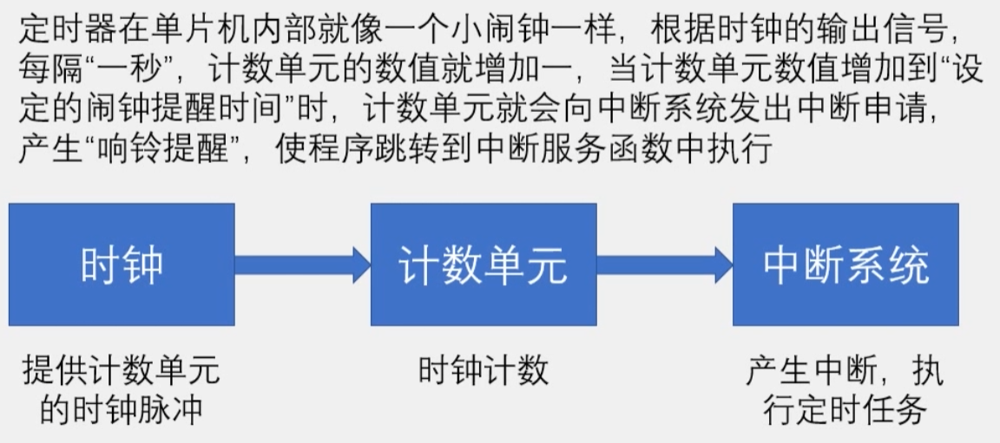

定时器：51单片机的内部资源，电路连接和运转均在单片机内部完成。
作用：

1. 用于计时系统，实现软件计时，或使程序每隔一固定时间完成一项操作
2. 替代长时间的Delay，提高CPU的运行效率和处理速度。
STC89C52定时器资源：
    个数：3个（T0，T1，T2），T0，T1与传统51单片机兼容，T2是此型号单片机增加的资源
T0, T1的四种工作模式：
    模式0： 13位定时器/计数器
    模式1： 16位定时器/计数器（常用）
    模式2： 8位自动重装模式
    模式3： 两个8位计数器

SYSclk: 系统时钟（晶振周期），晶振为12MHz

STC89C52系列单片机提供了8个中断请求源：外部中断0、定时器0中断、外部中断1、定时器1中断、串口中断、外部中断2、外部中断3
中断优先级个数：4个
中断号：
||||
|:---:|:---:|:---:|
|void|Int0_Routine(void)|interrupt 0|
|void|Timer0_Routine(void)|interrupt 1|
|void|Int1_Routine(void)|interrupt 2|
|void|Timer1_Routine(void)|interrupt 3|
|void|UART_Routine(void)|interrupt 4|
|void|Timer2_Routine(void)|interrupt 5|
|void|Int2_Routine(void)|interrupt 6|
|void|Int3_Routine(void)|interrupt 7|
