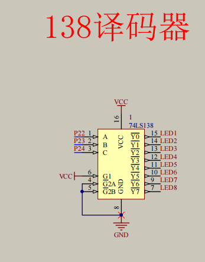
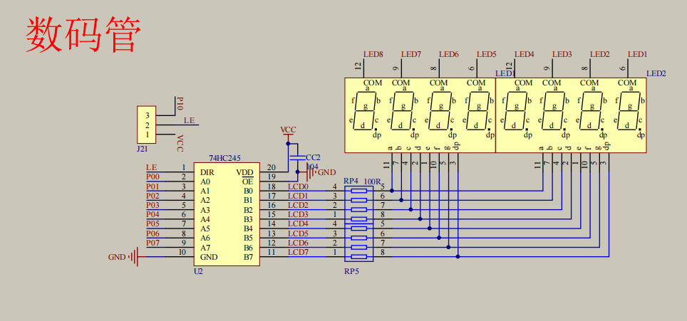
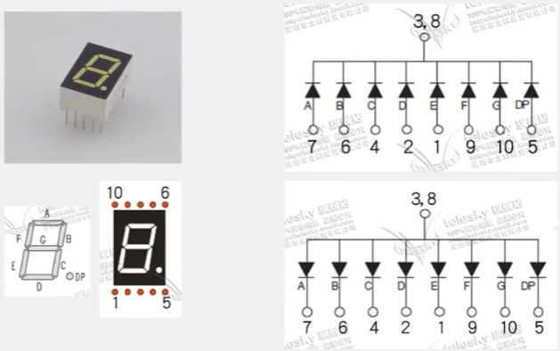
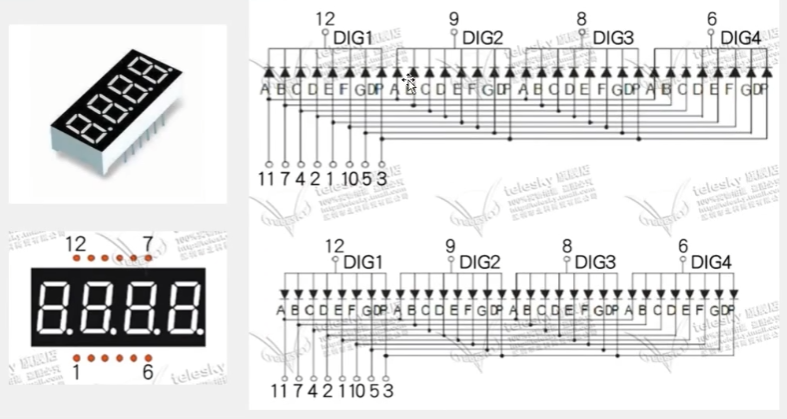

 
LED数码管：简单、廉价的显示器，由多个发光二极管封装在一起的“8”字型器件。
38译码器用来控制哪个LED应该亮
原理：显示第1位->显示第2位->...，快速循环这个过程，实现数码管同时显示的效果。
74HC245：双向数据缓冲器

共阳极（0触发），共阴极（1触发）

6B,7A,8电平,9F,10G

1E,2D,3电平,4C,5DP
就近原则

同一时刻只显示一种数字（可以有多个）
数码管存在 “**消影**”
```C
// 数码管驱动方式：
// 专用驱动芯片：TM1640
// 单片机直接扫描：以下代码
#include <REGX52.H>

unsigned char NixieTable[] = { 0x3F, 0x06, 0x5B, 0x4F, 0x66, 0x6D, 0x7D, 0x07, 0x7F, 0x6F, 0x77, 0x7C, 0x39, 0x5E, 0x79, 0x71, 0x00 };

void Delay(unsigned int xms);
void NixieTube(unsigned char location, unsigned char number);

void main() {
	unsigned char i;
	while(1) {
		for(i = 1; i <= 8; ++ i) {
			NixieTube(i, i);
		}
	}
}

void Delay(unsigned int xms) {
	unsigned char i, j;
	while(xms --) {
		i = 2;
		j = 239;
		do {
			while (--j);
		} while (--i);
	}
}

void NixieTube(unsigned char location, unsigned char number) {
	location --;
	P2_4 = location >> 2 & 1; 
	P2_3 = location >> 1 & 1;
	P2_2 = location >> 0 & 1;
	P0 = NixieTable[number];
	Delay(1);
	P0 = NixieTable[16]; // 消影
}
```