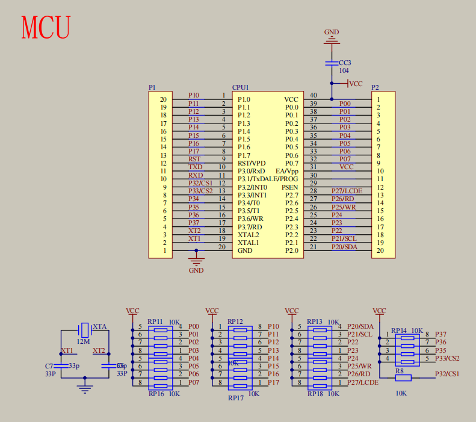

|关键字|所占位数|表示范围|
|:---:|:---:|:---:|
int|16|-32768~32767
short|16|-32768~32767
long|32|-2147483648~2147483647
unsigned int|16|0~65535
unsigned short int|16|0~65535
unsigned long int|32|0~4294967295
float|32|3.4e-38~3.4e38
double|64|1.7e-308~1.7e308|
char|8|-128~127
unsigned char|8|0~255

```C
_crol_(x, p) // 左移
_cror_(x, p) // 右移
```
