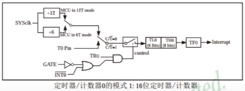

定时器：51单片机的内部资源，电路连接和运转均在单片机内部完成。
作用：

1. 用于计时系统，实现软件计时，或使程序每隔一固定时间完成一项操作
2. 替代长时间的Delay，提高CPU的运行效率和处理速度。
STC89C52定时器资源：
    个数：3个（T0，T1，T2），T0，T1与传统51单片机兼容，T2是此型号单片机增加的资源
T0, T1的四种工作模式：
    模式0： 13位定时器/计数器
    模式1： 16位定时器/计数器（常用）
    模式2： 8位自动重装模式
    模式3： 两个8位计数器





SYSclk: 系统时钟（晶振周期），晶振为12MHz

STC89C52系列单片机提供了8个中断请求源：外部中断0、定时器0中断、外部中断1、定时器1中断、串口中断、外部中断2、外部中断3
中断优先级个数：4个
中断号：
1. void Int0_Routine(void) interrupt 0 {}
2. void Timer0_Routine(void) interrupt 1 {}
3. void Int1_Routine(void) interrupt 2 {}
4. void Timer1_Routine(void) interrupt 3 {}
5. void UART_Routine(void) interrupt 4 {}
6. void Timer2_Routine(void) interrupt 5 {}
7. void Int2_Routine(void) interrupt 6 {}
8. void Int3_Routine(void) interrupt 7 {}

```C
// Timer0.h
#ifndef __TIMER0_H__
#define __TIMER0_H__

void Timer0_Init(void);

#endif
// Timer0.c
#include <REGX52.H>

/**
  *	@brief	定时器0初始化，1毫秒@12.000MHz
  *	@param	无
  *	@retval	无
  */
void Timer0_Init(void) {
	TMOD &= 0xF0;		// 把TMOD的低四位清零，高四位保持不变；& 1111 0000
	TMOD |= 0x01;		// 把TMOD的最低位置一，高四位保持不变；| 0000 0001
	TL0 = 0x18;		// 设置定时初值，64535 / 256
	TH0 = 0xFC;		// 设置定时初值，64535 % 256 + 1
	TF0 = 0;		// 清除TF0标志
	TR0 = 1;		// 定时器0开始计时
	ET0 = 1;
	EA = 1;
	PT0 = 0;
}


/*
// 定时器中断函数模板，不方便模块化
void Timer0_Routine() interrupt 1 { 
	static unsigned int T0Count;
	TL0 = 0x18;
	TH0 = 0xFC;
	T0Count ++;
	if(T0Count >= 1000) {
		T0Count = 0;
		// function()
		// eg: P2_0 = ~P2_0;
	}
	
}
*/
// main.c-1
// 独立按键控制流水灯
#include <REGX52.H>
#include <INTRINS.H>

#include "Timer0.h"
#include "Key.h"
#include "Delay.h"

unsigned char KeyNum, LEDMode;

void main() {
	P2 = 0xFE;
	Timer0_Init();
	while(1) {
		KeyNum = Key();
		if(KeyNum) {
			if(KeyNum == 1) {
				LEDMode ++;
				if(LEDMode >= 2) LEDMode = 0;
			}
		}
	}
}

// 定时器中断函数模板，不方便模块化
void Timer0_Routine() interrupt 1 { 
	static unsigned int T0Count;
	TL0 = 0x18;
	TH0 = 0xFC;
	T0Count ++;
	if(T0Count >= 500) { // 500ms
		T0Count = 0;
		if(LEDMode == 0) {
			P2 = _crol_(P2, 1);
		} else if(LEDMode == 1) {
			P2 = _cror_(P2, 1);
		}
	}
}

// main.c-2
// 时钟
#include <REGX52.H>

#include "Delay.h"
#include "LCD1602.h"
#include "Timer0.h"

unsigned char Hour = 23, Min = 58, Sec = 57;

void main() {
	LCD_Init();
	Timer0_Init();
	LCD_ShowString(1, 1, "Clock:");
	LCD_ShowString(2, 1, "  :  :");

	while(1) {
		LCD_ShowNum(2, 1, Hour, 2);
		LCD_ShowNum(2, 4, Min, 2);
		LCD_ShowNum(2, 7, Sec, 2);
	}
}


void Timer0_Routine() interrupt 1 { 
	static unsigned int T0Count;
	TL0 = 0x18;
	TH0 = 0xFC;
	T0Count ++;
	if(T0Count >= 1000) {
		T0Count = 0;
		Sec ++;
		if(Sec >= 60) {
			Sec = 0;
			Min ++;
			if(Min >= 60) {
				Min = 0;
				Hour ++;
				if(Hour >= 24) {
					Hour = 0;
				}
			}
		}		
	}
}
```