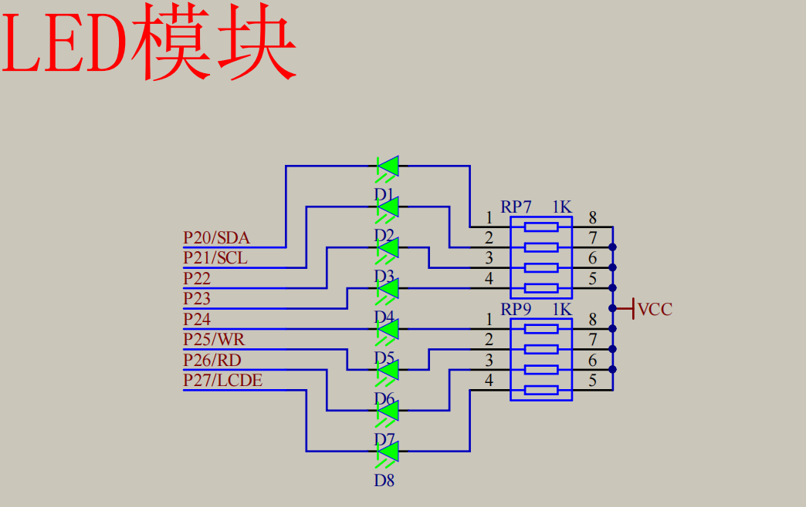
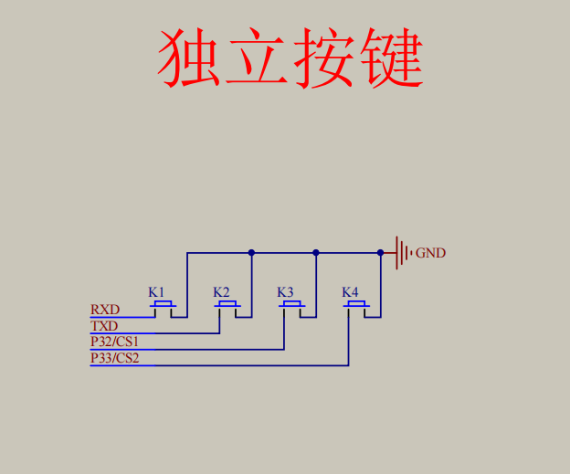
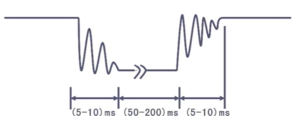

LED(Light Emitting Diode)：照明、屏幕等


```C
// 流水灯
#include <REGX52.H>
#include <INTRINS.H>

void Delayxms(unsigned int xms)		//@12.000MHz
{
	unsigned char i, j;
	while(xms --) {
		i = 2;
		j = 239;
		do
		{
			while (--j);
		} while (--i);
	}
}

void main() {
	// 1
	unsigned char now = 0;
	while(1) {
		P2 = (1 << 8) - 1 - (1 << now);
		Delayxms(now * 50);
		if(++ now == 8) now = 0;
	}
	// 2
	while(1) {
		P2 = 0xFE;
		while(1) {
			P2 <<= 1;
			P2 += 1;
			if(P2 == 0xFF) P2 --;
			Delayxms(500);
		}
	}
}


```



```C
// 按键控制，按下为0（按键抖动可能造成误操作）
// K1(RXD): P31, K2(TXD): P30
#include <REGX52.H>

void Delay(unsigned int xms);

unsigned char LEDNum = 0;

void main() {
	P2 = 0x01;
	while(1) {
		if(P3_1 == 0) {
			Delay(20);
			while(P3_1 == 0);
			Delay(20);
			LEDNum ++;
			if(LEDNum >= 8) LEDNum = 0;
			P2 = ~(0x01 << LEDNum);
		}
		if(P3_0 == 0) {
			Delay(20);
			while(P3_0 == 0);
			Delay(20);
			if(LEDNum == 0) LEDNum = 7;
			else LEDNum --;
			P2 = ~(0x01 << LEDNum);
		}
	}
}

void Delay(unsigned int xms) {
	unsigned char i, j;
	while(xms --) {
		i = 2;
		j = 239;
		do
		{
			while (--j);
		} while (--i);
	}
}
```