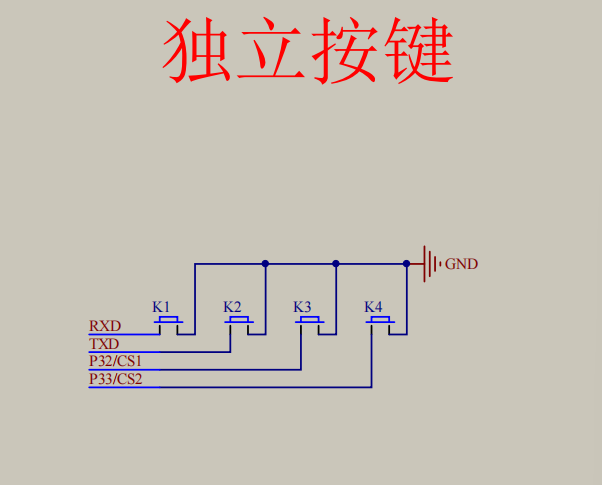
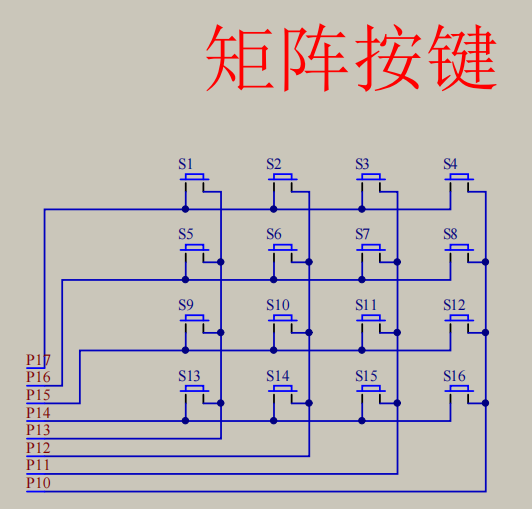

键盘中按键数量过多时，为了减少I/O口的占用，通常将按键排列成矩阵形式，采用逐行或逐列的“扫描”，读取任何位置按键的状态
原理：读取第1行(列)->读取第2行(列)->...，快速循环这个过程，最终实现所有按键同时检测的效果。


```c
// MatrixKey.c
#include <REGX52.H>
#include "Delay.h"

/**
  *	@brief	矩阵键盘读取该按键
  *	@param	无
  *	@retval	KeyNumber 按下按键的键码值
			如果按键不放，程序会停留在此函数，松手一瞬间，返回按键键码，没有按键按下时，返回0
  */
unsigned char MatrixKey() {
	unsigned char KeyNumber = 0;
	
	P1 = 0XFF;
	P1_3 = 0;
	if(P1_7 == 0) { Delay(20); while(P1_7 == 0); Delay(20); KeyNumber = 1; }
	if(P1_6 == 0) { Delay(20); while(P1_6 == 0); Delay(20); KeyNumber = 5; }
	if(P1_5 == 0) { Delay(20); while(P1_5 == 0); Delay(20); KeyNumber = 9; }
	if(P1_4 == 0) { Delay(20); while(P1_4 == 0); Delay(20); KeyNumber = 13; }

	P1 = 0XFF;
	P1_2 = 0;
	if(P1_7 == 0) { Delay(20); while(P1_7 == 0); Delay(20); KeyNumber = 2; }
	if(P1_6 == 0) { Delay(20); while(P1_6 == 0); Delay(20); KeyNumber = 6; }
	if(P1_5 == 0) { Delay(20); while(P1_5 == 0); Delay(20); KeyNumber = 10; }
	if(P1_4 == 0) { Delay(20); while(P1_4 == 0); Delay(20); KeyNumber = 14; }

	P1 = 0XFF;
	P1_1 = 0;
	if(P1_7 == 0) { Delay(20); while(P1_7 == 0); Delay(20); KeyNumber = 3; }
	if(P1_6 == 0) { Delay(20); while(P1_6 == 0); Delay(20); KeyNumber = 7; }
	if(P1_5 == 0) { Delay(20); while(P1_5 == 0); Delay(20); KeyNumber = 11; }
	if(P1_4 == 0) { Delay(20); while(P1_4 == 0); Delay(20); KeyNumber = 15; }

	P1 = 0XFF;
	P1_0 = 0;
	if(P1_7 == 0) { Delay(20); while(P1_7 == 0); Delay(20); KeyNumber = 4; }
	if(P1_6 == 0) { Delay(20); while(P1_6 == 0); Delay(20); KeyNumber = 8; }
	if(P1_5 == 0) { Delay(20); while(P1_5 == 0); Delay(20); KeyNumber = 12; }
	if(P1_4 == 0) { Delay(20); while(P1_4 == 0); Delay(20); KeyNumber = 16; }
	
	return KeyNumber;
}
```


```C
// 矩阵键盘-密码锁
#include <REGX52.H>

#include "Delay.h"
#include "LCD1602.h"
#include "MatrixKey.h"

unsigned char KeyNum;
unsigned int Password, Count;

// S1-S10当作数字1.2.3...0
void main() {
	LCD_Init();
	LCD_ShowString(1, 1, "Password:");
	while(1) {
		KeyNum = MatrixKey();
		if(KeyNum) {
			if(KeyNum <= 10) {
				if(Count < 4) {
					Password = Password * 10 + KeyNum % 10;
					Count ++;
				}
				LCD_ShowNum(2, 1, Password, 4);
			} else if(KeyNum == 11) {
				if(Password == 1230) {
					LCD_ShowString(1, 10, "CORRECT");
				} else {
					LCD_ShowString(1, 10, "WRONG  ");
				}
				Password = 0;
				Count = 0;
				LCD_ShowString(2, 1, "    ");
			} else if(KeyNum == 12) {
				if(Count) {
					Password /= 10;
					Count --;
					LCD_ShowNum(2, 1, Password, 4);
				} else {
					LCD_ShowString(2, 1, "    ");
				}
			}
		}
	}
}
```