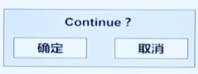

### 模块划分
```C
module_1.h // 声明函数和数据

extern int a; // module_1中声明变量 a
----------------------------------------

module_1.c // 定义函数

int a = 10; // 定义变量 a
static int b; // 仅在module_1中使用，加static
```

```C
module_2.c

#include "module_1.h" // 包含module_1的头文件

a = 1; // 可以使用module_1中的变量
```

```C
// Delay.h
#ifndef __DELAY_H__
#define __DELAY_H__

void Delay(unsigned int xms);

#endif

// Delay.c
void Delay(unsigned int xms) {
	unsigned char i, j;
	while(xms --) {
		i = 2;
		j = 239;
		do {
			while (--j);
		} while (--i);
	}
}

// Nixie.h
#ifndef __NIXIE_H__
#define __NIXIE_H__

void NixieTube(unsigned char location, unsigned char number);

#endif

// Nixie.c
#include <REGX52.H>
#include "Delay.h"

unsigned char NixieTable[] = { 0x3F, 0x06, 0x5B, 0x4F, 0x66, 0x6D, 0x7D, 0x07, 0x7F, 0x6F, 0x77, 0x7C, 0x39, 0x5E, 0x79, 0x71, 0x00 };

void NixieTube(unsigned char location, unsigned char number) {
	location --;
	P2_4 = location >> 2 & 1; 
	P2_3 = location >> 1 & 1;
	P2_2 = location >> 0 & 1;
	P0 = NixieTable[number];
	Delay(1);
	P0 = NixieTable[16];
}

// main.c
#include <REGX52.H>

#include "Delay.h"
#include "Nixie.h"

void main() {
	unsigned char i;
	while(1) {
		for(i = 1; i <= 8; ++ i) {
			NixieTube(i, i);
		}
	}
}
```

### 中断
```C
// 中断服务程序模型
typedef struct tagIntQueue {
   int intType; // 中断类型
   struct tagIntQueue *next;
} intQueue;
intQueue *IpIntQueueHead;

__interrupt ISRexample () {
   int intType;
   intType = GetSystemType(); // 得到中断类型
   QueueAddTail(IpIntQueueHead, intType); // 新的中断入队
}
```
```C
// 中断服务程序主程序
while(1) {
   if(!IsIntQueueEmpty()) {
      intType = GetFirstInt();
      switch(intType) {
         case xxx:
            break;
         case xxx:
            break;
         ...
      }
   }
}
```

### 类
```C
#define C_Class struct
C_Class A {
    C_Class A *A_this; // this 指针
    void (*foo)(C_Class A *A_this); // 函数指针
    int (*parea)(int length, int width);

    int a; // 数据
    int b;
}
```
#### 菜单实现方法
```C
// 传统按下OK键（多个菜单项）
void onOkKey() {
    switch(currentFocus) {
        case MENU_1:
            menu_1_OnOk();
            break;
        case MENU_2:
            menu_2_OnOk();
            break;
        ...
    }

// 第二种方法
typedef struct tagSysMenu {
    char *text; // 菜单文本
    BYTE xPos; // 菜单在LCD上的x坐标
    BYTE yPos; // 菜单在LCD上的y坐标
    void (*onOkFun)(); // 在菜单上按下ok键的处理函数指针
    void (*onCancelFun)(); // 在菜单上按下cancel键的处理函数指针
} SysMenu, *LPSysMenu;

static SysMenu menu[MENU_NUM] = {
    { "menu_1", 0, 48, menu_1_OnOk, menu_1_OnCancel },
    { "menu_2", 7, 48, menu_2_OnOk, menu_2_OnCancel },
    ...
};

void OnOkKey() {
    menu[currentFocusMenu].onOkFun();
}
void OnCancelKey() {
    menu[currentFocusMenu].onCancelFun();
}
```
#### 少量汉字
```C
#define EX_FONT_WORD(value) (value)
#define EX_FONT_UNICODE_VAL(value) (value)
typedef struct _wide_unicode_font16x16 {
   unsigned char word[3];
   int value; // 内码
   unsigned char data[32]; // 字模点阵
} Unicode;

#define CHINESE_CHAR_NUM   4  // 汉字数量

Unicode chinese[CHINESE_CHAR_NUM] = {
   {
      EX_FONT_WORD("业"),
      EX_FONT_UNICODE_VAL(0x4e1a),
      {
         0x04, 0x40, 0x04, 0x40, 0x04, 0x40, 0x04, 0x44,
         0x44, 0x46, 0x24, 0x4c, 0x24, 0x48, 0x14, 0x50,
         0x1c, 0x44, 0xff. 0xfe, 0x00, 0x00, 0x00, 0x00
      }
   }, 
   {
      {...}, {..}, {...}
   }
}
```

```C
// 模拟MessageBox函数
typedef enum TYPE {ID_OK, ID_OKCANCEL} MSG_TYPE;
extern BYTE MessageBox(LPBYTE IpStr, BYTE TYPE) {
    BYTE keyValue = -1;
    ClearScreen(); // 清除屏幕
    DisplayString(xPos, yPos, IpStr， TRUE); // 显示字符串
    switch(TYPE) {
        case ID_OK: // 只有确定按钮
            DisplayString(13, yPos + High + 1, "确定", 0);
            break;
        case ID_OKCANCEL: // 双按钮
            DisplayString(8, yPos + High + 1, "确定", 0);
            DisplayString(17, yPos + High + 1, "取消", 0);
            break;
        default:
            break;
    }
    DrwaRect(0, 0, 23, yPos + High + 16 + 4); // 绘制外框
    // MessageBox是模式对话框，阻塞运行，等待按钮
    while((keyValue != KEY_OK) && (keyValue != KEY_CANCEL)) {
        keyValue = getSysKey();
        if(keyValue == KEY_OK) return ID_OK;
        if(keyValue == KEY_CANCEL) return ID_CANCEL;
    }
}
```

```C
// 窗口元素、消息处理函数封装在窗口中
struct windows {
   BYTE currentFocus;
   ELEMENT element[ELEMENT_NUM];
   void (*messageFunction) (BYTE keyValue);
}

void messageFunction(BYTE keyValue) {
   BYTE i = 0; // 获得焦点元素
   while( (element[i].ID != currentFocus && i < ELEMENT_NUM) ) {
      i ++;
      if(i < ELEMENT_NUM) { // 消息映射
         switch(keyValue) {
            case OK:
               element[i].OnOk();
               break;
            ...
         }
      }
   }
}
```


